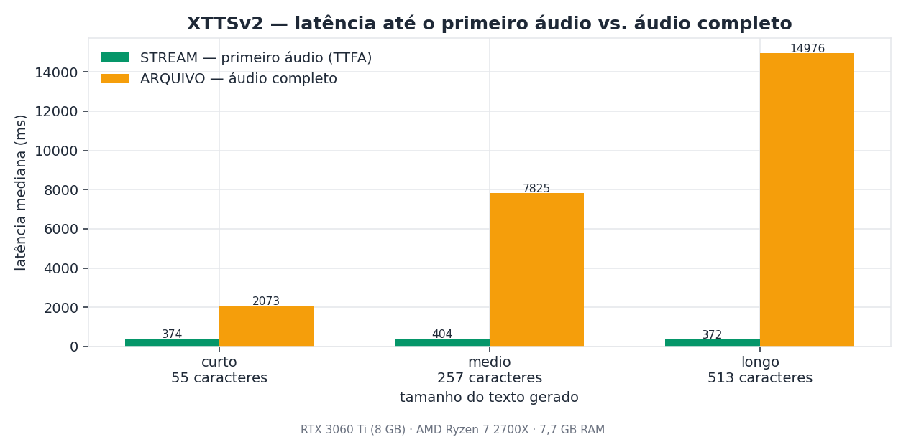
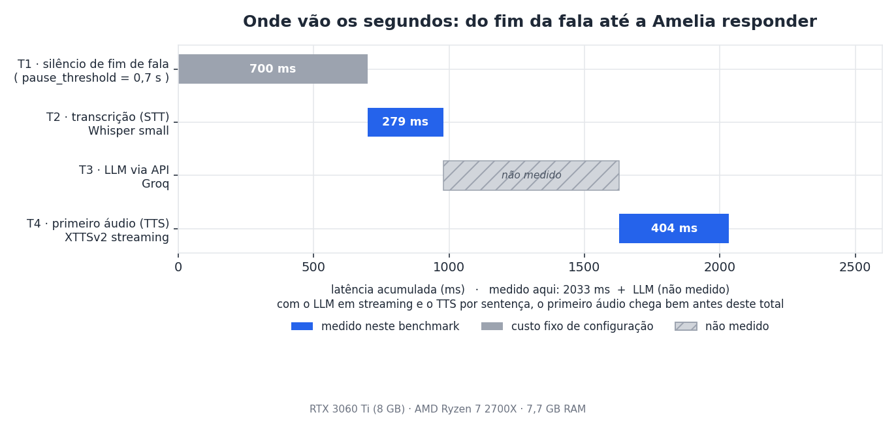
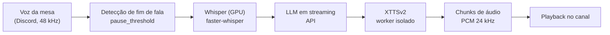
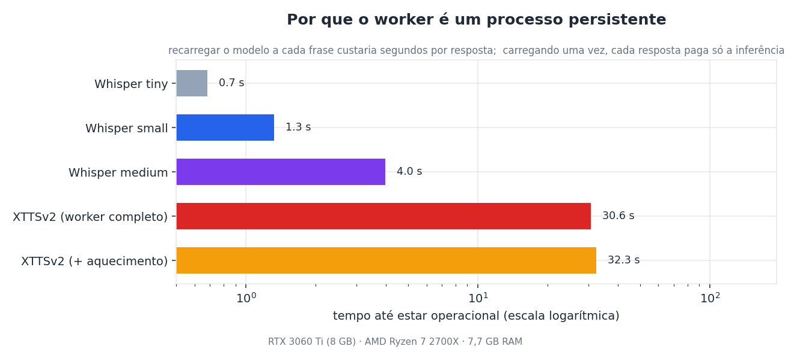
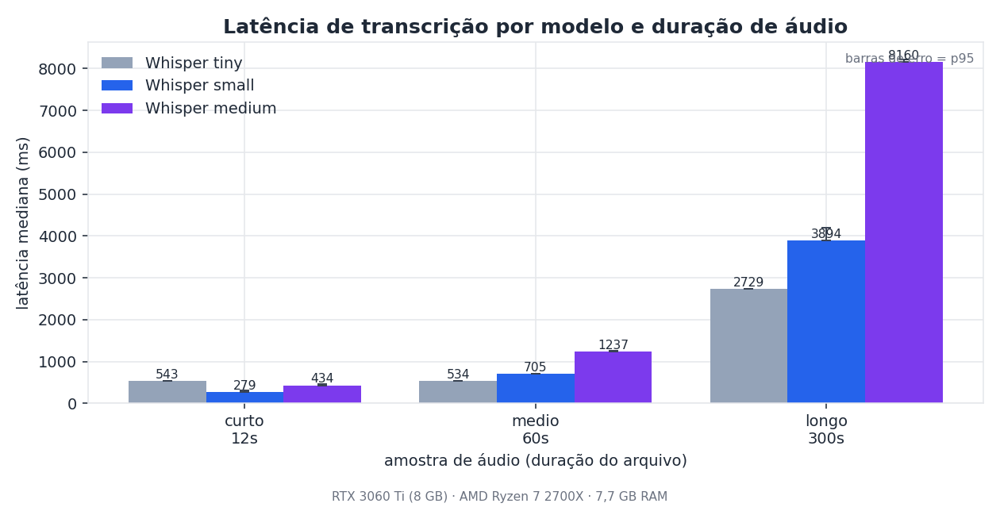
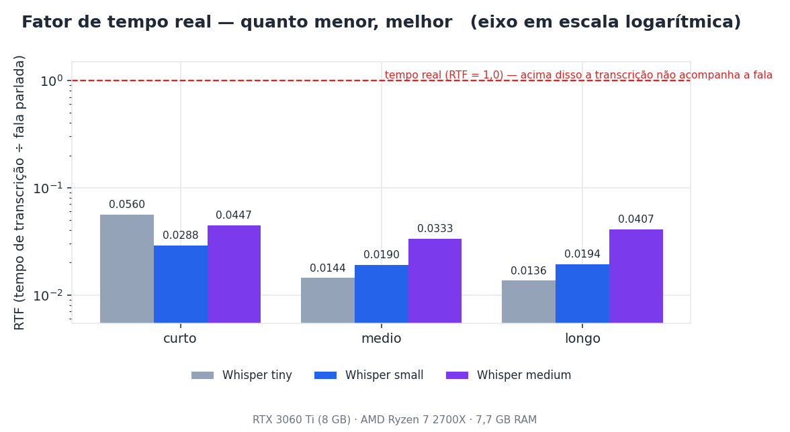

# A.M.E.L.I.A. — motor de voz para RPG de mesa no Discord

Motor de áudio que **ouve a mesa, transcreve, conversa e responde com voz gerada localmente**.
Construído para uma campanha de RPG que roda em Discord: o bot entra no canal de voz, escuta os
jogadores e o mestre, e responde como um NPC — com voz própria, sintetizada na máquina.

É um **pipeline de voz em tempo real** com modelos de ML rodando em GPU,
arquitetura de workers por processo e medições reproduzíveis.

Algumas informações podem estar desatualizadas, ja que faço melhorias constantes na engine

| | |
|---|---|
| **Primeiro áudio da resposta** | **~0,4 s** — e **constante**, independente do tamanho do texto |
| **Transcrição** | **279 ms** numa fala curta (RTF 0,029 — ~35× mais rápido que tempo real) |
| **Voz** | XTTSv2 local, 24 kHz, clonada a partir de uma amostra de referência |
| **Throughput** | 513 caracteres sintetizados em **15 s** — mas a mesa ouve a partir de **0,37 s** |





*Medido numa RTX 3060 Ti (8 GB) com Ryzen 7 2700X e 7,7 GB de RAM. Todo gráfico deste README é
gerado pelos scripts em [`benchmarks/`](benchmarks/) — as medições são reproduzíveis.*

---

## O problema

Numa mesa de RPG online, o mestre narra, os jogadores conversam por cima, e todo mundo espera uma
resposta imediata. Um assistente de voz precisa resolver três coisas ao mesmo tempo:

1. **Saber quando você terminou de falar** — sem cortar quem pausou para pensar
2. **Entender o que foi dito** — com nomes próprios de ficção científica que nenhum modelo conhece
3. **Responder com voz** — rápido o bastante para não quebrar a mesa

A terceira é a mais difícil: gerar voz localmente com qualidade leva segundos. O que este projeto
faz é **começar a tocar antes de terminar de gerar**.

## Como funciona



O detalhe que sustenta a latência baixa está entre **E** e **F**: o modelo não devolve um arquivo
pronto, ele devolve **pedaços de áudio conforme gera**. A mesa começa a ouvir a primeira frase
enquanto o resto ainda está sendo sintetizado.

A arquitetura completa, módulo por módulo, está em [`docs/arquitetura.md`](docs/arquitetura.md).

## Decisões de engenharia

### O TTS roda em processo separado

O XTTSv2 e o Whisper disputam as mesmas bibliotecas CUDA no mesmo processo. A solução foi isolar o
TTS num **processo próprio**, que conversa por JSON (uma linha por requisição em stdin/stdout).

O custo dessa decisão está medido: carregar o modelo leva **~30 s**. Por isso ele carrega **uma vez**
e fica residente — cada resposta paga apenas a inferência.



### A voz sai em chunks, não em arquivo

Dois modos de operação, e a diferença entre eles é toda a experiência do usuário:

| Tamanho do texto | Áudio completo | **Primeiro áudio** |
|---|---|---|
| 55 caracteres | 2.073 ms | **374 ms** |
| 257 caracteres | 7.825 ms | **404 ms** |
| 513 caracteres | 14.976 ms | **372 ms** |

O tempo de áudio completo cresce linearmente com o texto. O tempo até o primeiro áudio **não
cresce** — é constante em ~0,4 s. Numa resposta de 513 caracteres, isso é **40× menos espera
percebida**.

### O silêncio de fim de fala é configurável — e caro

> ⚙️ **Não medido — decisão de configuração.** O valor abaixo **não** veio de benchmark: é um
> parâmetro escolhido no código. O ganho que ele promete é **calculado**, não medido (ver adiante).

O bot espera um tempo de silêncio antes de decidir que a pessoa acabou de falar. Esse valor
(`pause_threshold = 0,7 s`) é **um dos maiores itens isolados da latência da pipeline** e não custa
GPU nenhuma: é decisão de configuração, não de hardware.

A redução de 1,0 s para 0,7 s encurta a decisão de fim de fala em **0,3 s por resposta**. Esse
número é **aritmética** (1,0 − 0,7), listado aqui de propósito como **cálculo, não medição**. Medir
esse ganho de ponta a ponta exigiria instrumentar a captura de áudio numa sessão real — o que este
projeto **não** fez.

### A divisão em sentenças acontece na camada de cima

O texto do LLM é cortado em sentenças **antes** de chegar ao TTS, na mesma thread que consome o
stream do modelo. Isso permite encadear: enquanto uma frase é falada, a próxima é sintetizada.

## Transcrição

Medido com `faster-whisper` nos parâmetros de produção (`language="pt"`, `beam_size=4`,
`vad_filter=True`), em três tamanhos de áudio:

| Modelo | Carga | 12 s (fala 9,7 s) | 60 s (fala 37,1 s) | 300 s (fala 200,5 s) | RTF |
|---|---|---|---|---|---|
| `tiny` (int8) | 0,7 s | 543 ms | 534 ms | 2.729 ms | 0,014 |
| `small` (float16) | 1,3 s | **279 ms** | 705 ms | 3.894 ms | 0,019 |
| `medium` (float16) | 4,0 s | 434 ms | 1.237 ms | 8.160 ms | 0,041 |





**RTF abaixo de 1,0 significa mais rápido que tempo real.** O RTF é calculado sobre a **duração de
fala detectada pelo VAD**, não sobre o tamanho do arquivo: gravações de sessão contêm silêncio
(entre 19% e 38% do arquivo, medido), e usar o tamanho bruto faria o modelo parecer mais rápido do
que ele é.

## Como reproduzir

```bash
# 1. Preparar o áudio de teste (qualquer gravação em PCM 48 kHz mono)
ffmpeg -i seu_audio.ogg -ac 1 -ar 48000 -c:a pcm_s16le benchmarks/audio/teste_curto.wav

# 2. Rodar (precisa de GPU para os tempos deste README)
python benchmarks/bench_stt.py --rapido --repeticoes 3
python benchmarks/bench_tts.py --repeticoes 3

# 3. Gerar os gráficos a partir dos CSVs
python benchmarks/gerar_graficos.py
```

O método completo — hardware, número de execuções, warm-up, por que mediana e p95 e não média,
e o que **não** foi medido — está em [`benchmarks/METODOLOGIA.md`](benchmarks/METODOLOGIA.md).

## O que este projeto não mediu

Número inventado é pior que número ausente. Estas etapas aparecem **hachuradas** no gráfico do
pipeline porque não foram medidas:

- **Latência do LLM** — depende de rede e de serviço externo
- **Playback no Discord** — depende da conexão de voz
- **Reconexão e estabilidade sob sessões longas** — precisa de horas de operação real
- **Impacto do `pause_threshold`** (1,0 → 0,7 s) — o ganho de ~0,3 s é **cálculo de
  configuração**, não latência medida ponta a ponta

## Estado do projeto e roadmap

O que está pronto (a coluna *medido* aponta o que tem benchmark neste repo):

- [x] Captura de áudio do canal de voz e detecção de fim de fala
- [x] Transcrição local com Whisper (GPU) e cadeia de fallback
- [x] Síntese de voz local (XTTSv2) em processo isolado, com modo arquivo e streaming
- [x] Encadeamento LLM → TTS por sentença
- [x] Caixa de som (bot auxiliar), gravador de sessão, rolagem de dados, diagnóstico
- [x] Benchmarks reproduzíveis e instrumentação de latência

O que ainda **não** existe:

- [ ] **Agente com memória de longo prazo e skills** — a parte que transforma o motor num agente
- [ ] Testes automatizados para o protocolo do worker
- [ ] Suporte a Windows (o projeto foi desenvolvido em Linux)

### Visão: do motor ao agente

Este repositório é a **camada de voz** de algo maior. Hoje o motor ouve, transcreve e responde; o
passo seguinte é dar a ele **memória e ferramentas** — para que deixe de reagir a cada frase e
passe a *lembrar* da mesa.

O objetivo é evoluir para um **agente com memória de longo prazo e skills**: um assistente que
recorda o que aconteceu na sessão anterior, consulta as regras da campanha por conta própria, rola
dados quando faz sentido e mantém continuidade entre encontros — em vez de começar do zero a cada
resposta.

A arquitetura já foi pensada para isso: o pipeline é **modular** (captura → STT → LLM → TTS, cada
camada isolada num worker com protocolo definido). Adicionar memória é encaixar **mais uma camada**
nesse fluxo.

## Requisitos

- **GPU NVIDIA** com ~5 GB de VRAM livre (o modelo cabe em 8 GB com folga)
- Linux (testado em Ubuntu 24.04)
- Python 3.12, `faster-whisper`, `coqui-tts`, `py-cord`
- Um canal de voz no Discord e uma **amostra de voz de referência** (~1 MB de áudio limpo) para o
  XTTSv2 clonar

A amostra de voz usada no desenvolvimento é material privado e **não** está neste repositório.
Para usar o projeto, grave a sua própria.

## Licença

**AGPL-3.0** — você pode usar, estudar, modificar e distribuir, mas **quem oferecer este software
como serviço precisa disponibilizar o código-fonte das suas modificações**. A escolha é deliberada:
protege o projeto de ser revendido fechado por terceiros.

Para uso comercial sem as obrigações da AGPL, é possível negociar uma licença separada.

## Autor

**Kaio Moura Pontes** — kaio.moura@ufrrj.br
