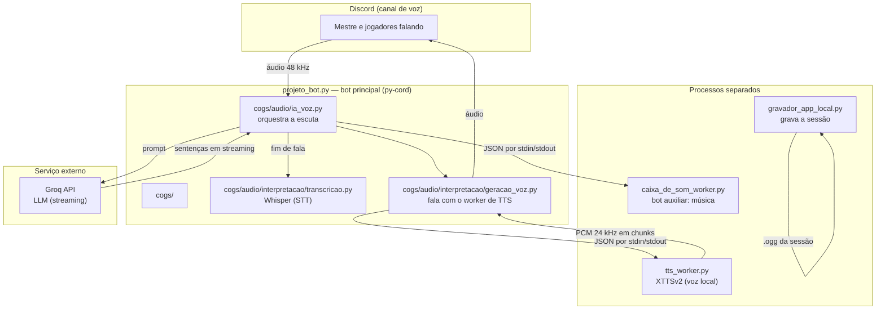

# Arquitetura da A.M.E.L.I.A.

Documento técnico do motor. O README dá a visão geral; aqui está o porquê de cada peça.

## Visão geral



## Módulos

| Módulo | Linhas | Responsabilidade | Por que existe assim |
|---|---|---|---|
| `cogs/audio/musica.py` | 1162 | Caixa de som, filas, yt-dlp | Feature mais usada na mesa |
| `cogs/audio/ia_voz.py` | 1080 | Escuta, VAD, orquestra LLM → TTS → playback | Concentra o pipeline ao vivo |
| `cogs/rpg/dados.py` | 793 | Rolagem de dados, histórico | Domínio de RPG |
| `cogs/audio/interpretacao/geracao_voz.py` | 746 | Fala com o worker de TTS, com fallback | Isola o protocolo do worker |
| `caixa_de_som_worker.py` | 482 | Bot auxiliar que toca áudio | Discord permite **uma** conexão de voz por bot |
| `gravador_app_local.py` | 435 | Gravação contínua da sessão | `sounddevice` + callback sem I/O no caminho quente |
| `projeto_bot.py` | 249 | Bootstrap do bot | — |
| `cogs/audio/interpretacao/transcricao.py` | 232 | Whisper com cadeia de fallback | GPU → CPU conforme o hardware aguenta |
| `tts_worker.py` | 227 | XTTSv2 em processo separado | Conflito de DLL cuDNN com o faster-whisper |
| `diagnostico.py` | 220 | Diagnóstico do ambiente | Suporte sem abrir IDE |
| `cogs/audio/voz.py` | 211 | Conexão de voz (join/leave) | Reconexão |

## Decisões de engenharia

### 1. O TTS vive num processo separado

**O problema:** o XTTSv2 e o faster-whisper disputam as mesmas bibliotecas CUDA (cuDNN). Carregar
os dois no mesmo processo trava ou corrompe a alocação.

**A solução:** `tts_worker.py` é um processo independente, que conversa por **JSON de uma linha por
vez** em stdin/stdout. O modelo carrega **uma vez** e fica residente; cada requisição custa só a
inferência.

**O custo medido dessa decisão:** carregar o XTTSv2 leva ~31 s. Se o modelo fosse recarregado a
cada fala, uma sessão de 3 h seria inviável. O worker persistente é o que torna a voz local
usável — e o benchmark mede exatamente esse número.

### 2. A voz em streaming, não em arquivo

O worker tem dois modos:

| Modo | Comportamento | Quando é melhor |
|---|---|---|
| `arquivo` | gera o WAV inteiro e devolve o caminho | Simples, mas o ouvinte espera tudo |
| `stream` | devolve **chunks de PCM em base64** conforme gera | Primeiro som sai muito antes |

O modo `stream` é o que sustenta a latência percebida baixa: a mesa começa a ouvir antes de a frase
terminar de ser sintetizada.

### 3. Um segundo bot como caixa de som

Discord só permite **uma conexão de voz por bot**. Em vez de gerenciar um único cliente com estados
conflitantes (tocar música *e* falar), o projeto sobe um **bot auxiliar** dedicado a áudio musical,
controlado por comandos JSON (`join`, `play`, `pause`, `volume`, `status`).

É uma solução de plataforma para uma limitação de plataforma — e desacopla o ciclo de vida dos dois
usos de voz.

### 4. O splitter de sentença fica na camada de cima

A thread que consome o stream do LLM **já corta o texto em sentenças** antes de mandar pro TTS
(`fila_sentencas`). Por isso o splitter interno do XTTS (`enable_text_splitting`) é redundante — e,
com o SpaCy ausente, virava ponto de falha. Ver `benchmarks/METODOLOGIA.md`, achado nº 1.

### 5. O aquecimento é separado do carregamento

O worker sinaliza **"Pronto para processar"** assim que o modelo está na VRAM — **antes** da
primeira inferência. A primeira inferência (que aloca os kernels CUDA) roda depois, em background,
e é reportada separadamente. Isso permite que a aplicação já saiba que o worker subiu sem esperar
o warmup terminar.

## Protocolo do worker de TTS

Uma requisição JSON por linha no stdin; uma resposta JSON por linha no stdout.

**Modo arquivo:**

```json
{"id": 1, "text": "texto a sintetizar", "file_path": "/caminho/saida.wav"}
{"id": 1, "status": "ok", "time": 2.31}
```

**Modo streaming:**

```json
{"id": 2, "text": "texto a sintetizar", "mode": "stream"}
{"id": 2, "type": "chunk", "audio": "<PCM float32 24 kHz mono em base64>"}
{"id": 2, "type": "done", "time": 2.57, "chunks": 6}
```

**Erro:**

```json
{"id": 2, "status": "error", "error": "mensagem"}
```

> ⚠️ **Quem consome o modo streaming precisa tratar `status: "error"`.** Sem isso, o leitor fica
> esperando chunks que nunca vêm. Este foi exatamente o erro cometido (e corrigido) no harness de
> benchmark em `benchmarks/bench_tts.py`.

## Onde a latência entra

| Etapa | Origem | Natureza |
|---|---|---|
| Detecção de fim de fala | `pause_threshold = 1,0 s` em `ia_voz.py` | **Configuração** — não é custo de máquina |
| Transcrição | faster-whisper | Hardware |
| LLM | API do Groq | Rede + serviço |
| Síntese | XTTSv2 local | Hardware (GPU) |
| Playback | Discord | Rede |

Os números medidos de cada etapa estão em `benchmarks/METODOLOGIA.md` e nos gráficos em
`benchmarks/graficos/`.
